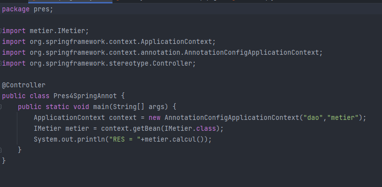

Realisée par: Kawtar Mounir

<h1 >Rapport de l'inversion de contrôle et l'injection des dépendances</h1>
<h2 style="color: cadetblue">Introduction</h2>

L'inversion de contrôle (IoC) est un concept qui simplifie la gestion des dépendances d'un objet en déléguant la responsabilité de leur instanciation. Dans le cadre de la création d'objets, Spring joue un rôle essentiel en prenant en charge l'injection des dépendances entre les différents composants, communément appelés Beans. Cette démarche garantit l'établissement de toutes les relations requises de manière automatique.
Ce mécanisme offre aux développeurs la possibilité de focaliser davantage leur attention sur la logique métier de leur application. En parallèle, Spring prend en charge l'injection des dépendances et propose un éventail de fonctionnalités techniques pour simplifier le développement.

<h2 style="color: cadetblue">Ennoncé</h2>
<ol>
    <li>Couche DAO 
        <ul>
            <li>créer l'interface IDao</li>
            <li>créer une implémentation de l'interface IDao</li>
        </ul>
    </li>
    <li>Couche Métier
        <ul>
            <li>créer l'interface IMetier</li>
            <li>créer une implémentation de l'interface IMetier</li>
        </ul>
    </li>
    <li>Couche Présentation
        
Créer une application qui permet de faire l'injection des dépandences

        <ul>
        <li>Instantiation statique</li>
        <li>Instantiation dynamique</li>
        <li>En utilisant Spring Framework
            <ul>
                <li>version XML</li>
                <li>version Annotation</li>
            </ul>
        </li>
        </ul>
    </li>
</ol>
<h2 style="color: cadetblue">Conception</h2>
<h3>Principe du couplage faible</h3>

Lorsque notre objectif est d'obtenir un faible couplage entre les composants, l'utilisation d'interfaces joue un rôle crucial. Pour illustrer ce concept, considérons deux classes : `DaoImpl`, qui implémente l'interface `IDao`, et `MetierImpl`, qui implémente l'interface `IMetier`.

Lorsque la classe `MetierImpl` est associée à l'interface `IDao`, cela signifie que la classe `MetierImpl` et la classe `IDaoImpl` (ou toute autre classe qui implémente l'interface `IDao`) sont liées par un faible couplage.

Cela implique que la classe `MetierImpl` peut collaborer avec n'importe quelle classe qui respecte le contrat établi par l'interface `IDao`. En réalité, la classe `MetierImpl` n'a connaissance que de l'existence de cette interface, ce qui signifie qu'elle peut être associée à n'importe quelle classe qui implémente cette interface, sans nécessiter de modifications au sein de la classe `MetierImpl`.

Le faible couplage permet ainsi de concevoir des applications qui résistent aux modifications internes tout en restant flexibles pour les extensions futures.

<h2 style="color: cadetblue">Captures d'écrans</h2>
<h3>Création de l'interface IDao</h3>

<h3>Création d'une implémentation de l'interface IDao version Base de Données</h3>

<h3>Création d'une implémentation de l'interface IDao version web services</h3>

<h3>Création de l'interface IMetier</h3>

<h3>Création d'une implémentation de l'interface IMetier</h3>

<h3>Instantiation statique</h3>

<h3>Instantiation dynamique</h3>

<h3>Injection des dépendances en utilisant Spring version xml</h3>

On doit installer en premier lieu les dépandences, ensuite ajouter un fichier config.xml

<h3>Injection des dépendances en utilisant Spring version annotations</h3>

Repository Class

Service Class

Controller

